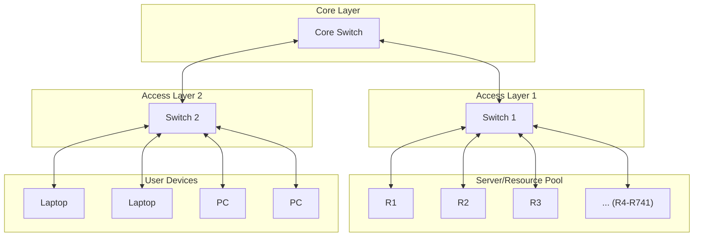

#Bus Topology Schematic
# Network Topology

## Schematic Diagram

## Physical Layout
- **Coordinates**: x: 3590, y: 780
- **Total Resources**: 741 nodes (R1-R741)
- **Network Type**: Logical topology with physical positioning data
