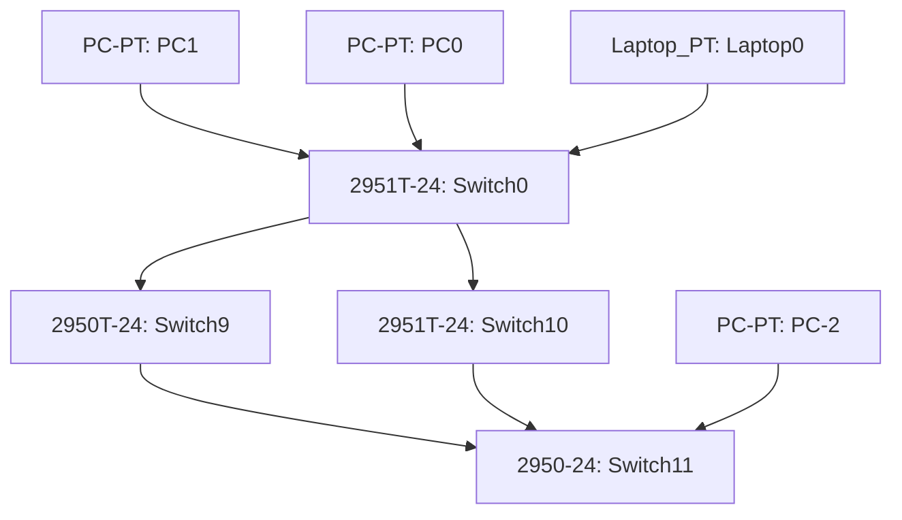

#Bus Topology Schematic

```mermaid
graph TB
    PC1[PC-PT: PC1] --> Switch0[2951T-24: Switch0]
    PC0[PC-PT: PC0] --> Switch0
    Laptop0[Laptop_PT: Laptop0] --> Switch0
    
    Switch0 --> Switch9[2950T-24: Switch9]
    Switch0 --> Switch10[2951T-24: Switch10]
    
    Switch9 --> Switch11[2950-24: Switch11]
    Switch10 --> Switch11
    
    PC2[PC-PT: PC-2] --> Switch11
```
